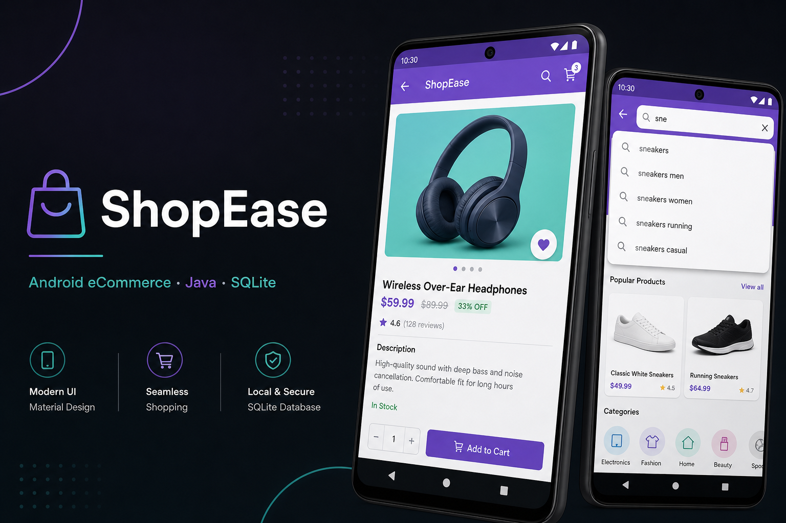

# ShopEase — Portfolio Overview

**Academic Android project (ICT372)** · King's Own Institute — local eCommerce app with SQLite and Material Design.

**This repository includes the full Android source code** (Gradle project in-repo).

## My contribution (Habib Khan)

- **Product Detail** screen — layout, product binding, add-to-cart
- **Search** screen — type-ahead SQLite queries, `RecyclerView` results, navigation to detail
- Integration with `DatabaseHelper`, cart model, and Material Design patterns

## Screenshots

| App overview |
|:---:|
|  |

> Add emulator screenshots of Search and Product Detail to `docs/screenshots/` when available.

## Features

- Product catalog, detail, and **search with type-ahead** SQLite queries
- Shopping cart and checkout flow
- User registration, login, session management
- Purchase history

## Stack

- Java · Android SDK
- SQLite (`DatabaseHelper`)
- Material Design XML layouts

## Full source

Application source is maintained in the **`ShopEase`** repository (can be private for coursework; this portfolio repo is the public showcase).

## Build

Open the full `ShopEase` project in Android Studio, sync Gradle, run on emulator or device. Do not commit `local.properties`.

## Author

**Habib Khan** · [GitHub](https://github.com/hk204844-ui)
